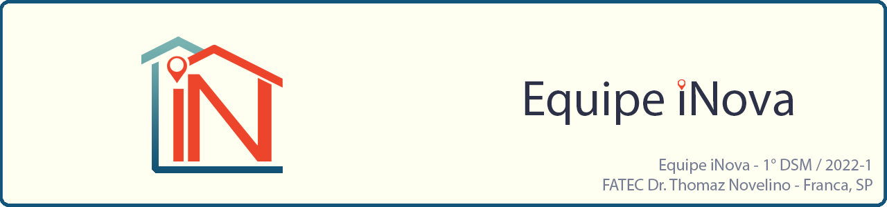

 

 

    <a href="#sobre">Sobre</a>  |     
    <a href="#tecnologias">Tecnologias</a>  |  
    <a href="#equipe">Equipe</a>  |  
    <a href="#final">Apresentação Final</a>

## :bookmark_tabs: Sobre o projeto

A partir do desafio proposto no projeto interdisciplinar do curso Desenvolvimento de Software Multiplataforma da Fatec Franca de construir um site, nosso grupo desenvolveu um site voltado para uma agência imobiliária focada em ajudar estudantes universitários, que precisam se mudar para estudar e tem dificuldades para encontrar algum imóvel próximo a sua universidade, o site além da ênfase nos imóveis universitários, tambem terá imóveis residenciais e comerciais para o cliente alugar ou comprar.

:pushpin: Status do Projeto: 🚧 **Em construção** 🚧

→ [Voltar ao topo](#topo)

## 🛠️ Tecnologias 🛠️ 

As seguintes ferramentas, linguagens, bibliotecas e tecnologias foram usadas na construção do projeto:

:pushpin: Status do Projeto: 🚧 **Em construção** 🚧

→ [Voltar ao topo](#topo)

## :busts_in_silhouette: Equipe
    
| Nome                    | LinkedIn & GitHub |
| :-----------------------| :---------------------------------------------------------------------------------------------------------------------------------------------------------------------------------------------------------------------------------------------------------------------------: | 
| Leonardo Alves Costa    |   |    
| Rafael Cesar Ferreira   |   |    
| Rafael Malaquias Chioca |   |

→ [Voltar ao topo](#topo)

## :clapper: Apresentação Final do Projeto :clapper:

Em breve.....
    

→ [Voltar ao topo](#topo)
